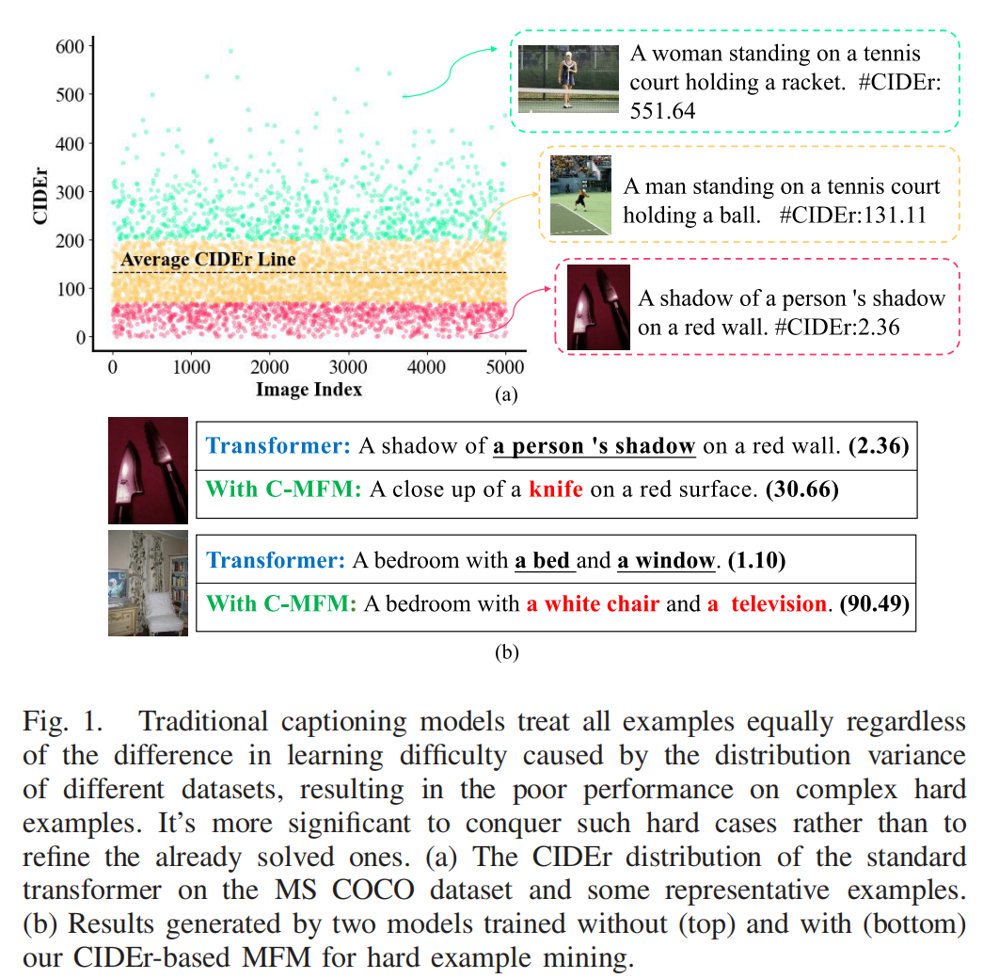
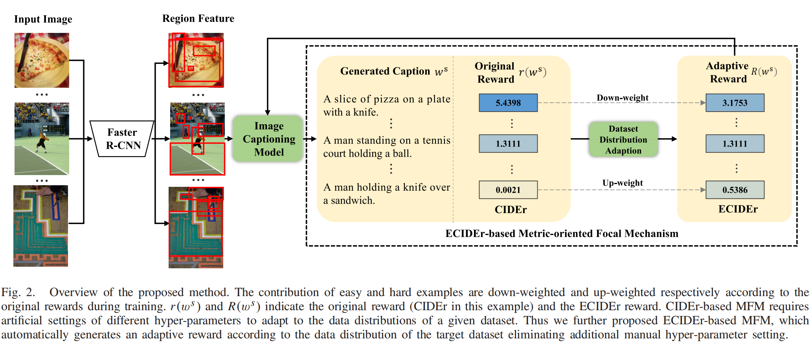

# Knowing What to Learn: A Metric-Oriented Focal Mechanism for Image Captioning


## Motivation



## Overview



## Environment setup

Please refer to [meshed-memory-transformer](https://github.com/aimagelab/meshed-memory-transformer)

## Data preparation

* **Annotation**. Download the annotation file [annotation.zip](https://drive.google.com/file/d/1i8mqKFKhqvBr8kEp3DbIh9-9UNAfKGmE/view?usp=sharing). Extarct and put it in the project root directory.
* **Feature**. You can download our ResNeXt-101 feature (hdf5 file) [here](https://pan.baidu.com/s/1xVZO7t8k4H_l3aEyuA-KXQ). Acess code: jcj6.
* **evaluation**. Download the evaluation tools [here](https://pan.baidu.com/s/1xVZO7t8k4H_l3aEyuA-KXQ). Acess code: jcj6. Extarct and put it in the project root directory.


## Training
```python

### CIDEr-Based MFM Training on Region Feature

python region_cmfm.py --exp_name Region_CMFM --batch_size 50 --rl_batch_size 100 --workers 4 --head 8 --warmup 10000 --features_path your_region_feature_path --annotation /home/data/m2_annotations --logs_folder tensorboard_logs


### ECIDEr-Based MFM Training on Region Feature

python region_emfm.py --exp_name Region_EMFM --batch_size 50 --rl_batch_size 100 --workers 4 --head 8 --warmup 10000 --features_path your_region_feature_path --annotation /home/data/m2_annotations --logs_folder tensorboard_logs


### CIDEr-Based MFM Training on Grid Feature

python grid_cmfm.py --exp_name Grid_CMFM --batch_size 50 --rl_batch_size 100 --workers 4 --head 8 --warmup 10000 --features_path your_grid_feature_path --annotation /home/data/m2_annotations --logs_folder tensorboard_logs


### ECIDEr-Based MFM Training on Grid Feature

python grid_emfm.py --exp_name Grid_EMFM --batch_size 50 --rl_batch_size 100 --workers 4 --head 8 --warmup 10000 --features_path your_grid_feature_path --annotation /home/data/m2_annotations --logs_folder tensorboard_logs

```
## Evaluation
```python
python eval.py --batch_size 50 --exp_name MFM --features_path your_feature_path --annotation /home/data/m2_annotations
```

## Citation
```
@ARTICLE{
    ji2022koniwing,  
    author={Ji, Jiayi and Ma, Yiwei and Sun, Xiaoshuai and Zhou, Yiyi and Wu, Yongjian and Ji, Rongrong},  
    journal={IEEE Transactions on Image Processing},   
    title={Knowing What to Learn: A Metric-Oriented Focal Mechanism for Image Captioning},   
    year={2022},  
    volume={31},  
    number={},  
    pages={4321-4335},  
    doi={10.1109/TIP.2022.3183434}
    }
```
